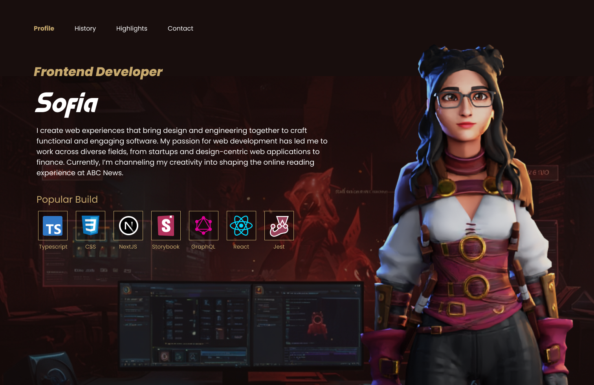

# Portafolio 3D con temática de videojuego

## Recursos utilizados para crear el modelo y animaciones

1. Avatar creado con [Ready Player Me](https://readyplayer.me/)
2. Animaciones de [Mixamo](https://www.mixamo.com/#/)
3. [Blender](https://www.blender.org/) para agregar las animaciones al modelo 4.[Plugin de Mixamo](https://gitlab.com/x190/mixamo_blender4) para Blender
4. Tutorial de como instalar el pluging [[FIXED] Mixamo addon for Blender 4!](https://www.youtube.com/watch?v=UNDXffLwtq4)

## Diseño

